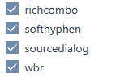

# Unusual but could be useful plugins for CKEditor 4 in processwire

First and foremost, for this to work, you need to ask CKEditor to be nice and not delete what you are going to insert. To do this, in your site/modules/InputfieldCKEditor/ folder, create a config.js file and put the following in it:

```javascript
CKEDITOR.editorConfig = function( config ) {
	// CKEDITOR.config.extraAllowedContent = 'section[id,class] wbr';
	CKEDITOR.config.extraAllowedContent = 'wbr';
	CKEDITOR.config.entities_additional = 'shy';
};
```

Not necessarily only that of course, if you have other things in your configuration, just add the two lines\
CKEDITOR.config.extraAllowedContent = ‘wbr’;\
CKEDITOR.config.entities_additional = ‘shy’;\
if they are not already there\
the first one authorizes the HTML tag wbr and the second one authorizes the HTML entity &shy; (note that neither & nor ; should be included in the config file).

Once that's done, you just need to install the appropriate plugin(s).\
The wbr plugin to insert a <wbr /> tag: tells the browser where to break a word without displaying a visible hyphen.\
The insertsofthyphen plugin to... insert a soft hyphen, in other words, also tell the browser where to break a word, but this time displaying a hyphen that is not visible if the word fits in width, e.g.\
unconstitutionally\
or, if it becomes too narrow\
unconsti-\
tionally

To do this, it's easy. Go to your site/modules/InputfieldCKEditor/ folder. If there is no plugins folder, create one. If there is one, put the plugin(s) you are interested in inside it, including folders and files, without changing their names (or if you do, make the appropriate changes to the files and code).

Then check the desired additional extensions for the relevant field(s) (in the field tab).



and finally, in the list of toolbar buttons, add them wherever you want, for example
```
Format, Styles, FontSize, -, Bold, Italic, -, RemoveFormat, -,CreateDiv,
NumberedList, BulletedList, -, Blockquote
PWLink, Unlink, Anchor
PWImage, Table, HorizontalRule, SpecialChar
PasteText, PasteFromWord
Scayt, -, Sourcedialog, Maximize, wbr, softhyphen
```

There, the buttons will be at the end of the list after the button to view in full screen.

Of course, you can change the icons. Just change the png files in the icons folder, but be careful to name them exactly as the plugin name in lowercase letters.

**Important to know**: if you use soft hyphens, it can be a little frustrating because you won't see them in the source code or even in the database. This isn't related to CKEditor but to the behavior of the browser.
However, if you display the page and play around with the responsive design, you'll see it in action, with hyphens included in the places where you inserted them.

You can also add a keyboard shortcut to the plugin (example commented in the code), but I don't dare to do so in order to avoid conflicting with an existing shortcut or using shortcuts that are not compatible with all operating systems.